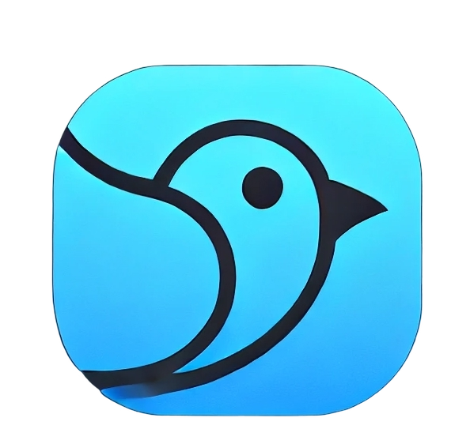

# **MERN-CHAT-APP (KABUTAR)** 💬
 

A basic real-time chat app built with the MERN stack (MongoDB, Express, React, Node.js) and powered by **Socket.IO**. "Kabutar" is a simple and a basic app to connect with friends, family, or colleagues instantly. This app allows seamless messaging with real-time updates and a smooth user experience. 

---

## **🌟Features**

- **Real-Time Chat**: Instant messaging between users with live updates using Socket.IO.
- **MERN Stack**: Leverages MongoDB, Express, React, and Node.js for full-stack development.
- **User Authentication**: Create, login, and manage accounts.
- **Responsive Design**: Fully responsive front-end built with React.
  
---

## **🛠Technologies Used**

- **Frontend**: React, Context, Zustand, Socket.IO-client
- **Backend**: Node.js, Express.js, Socket.IO
- **Database**: MongoDB
- **Authentication**: JWT (JSON Web Token)
- **Development Tools**: Nodemon, npm

---

## **🔥New Features Added**
- ✨ Feature 1: UI Updated with a new design and a new logo.
- 🔄 Feature 2: Update profile feature added.
- 🎥 Feature 3: Image and video sending feature added.
- 🖼️ Feature 4: Chat Background image adding feature added.

---

## **🚀Live Preview**
   
For Live Preview, Visit the link below:
https://mern-chat-app-kabutar-prod.onrender.com/login

---

_Last updated: 21-03-2025_
